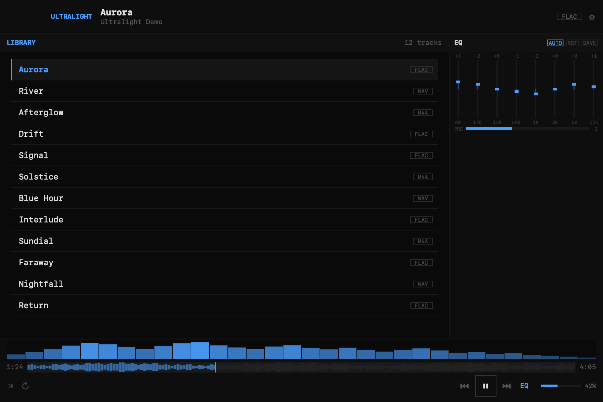

# Ultralight

A native macOS music player built around a 200 KB size budget.

Ultralight plays your local music library with an eight-band equalizer, per-track settings, and audio visualization. Written in Swift with AppKit, it uses the audio frameworks included with macOS and has no third-party dependencies.



*The native interface, shown with demo tracks and illustrative audio data.*

## Features

- **Local library.** Add music folders or drop them onto the player. Ultralight scans subfolders and reads embedded metadata; files stay in their original locations.
- **Per-track equalization.** Adjust the eight-band parametric EQ and select **SAVE** to keep a track's settings. Track analysis can apply an initial EQ curve when no saved profile exists.
- **Audio visualization.** A live spectrum shows the playing audio; the track waveform supports seeking.
- **Native controls.** Keyboard shortcuts, media keys, menu-bar playback controls, and accessible buttons and sliders.
- **Continuous playback.** Compatible tracks are scheduled back-to-back, with shuffle and repeat support. Continuous scheduling requires matching decoded sample rates and channel counts; other transitions use normal next-track playback.

Audio decoding is provided by macOS. File support depends on the codec and container; Ultralight does not bundle additional decoders.

## Build and run

Use an Apple silicon Mac with Xcode installed. The app targets macOS 14 or later. See the [build guide](BUILDING.md) for the reference toolchain and [verification record](docs/evidence/README.md) for tested environments.

```sh
git clone https://github.com/dungbeetlephoenix/ultralight-appkit.git
cd ultralight-appkit
swift run Ultralight
```

Open **Settings** to add a music folder, then double-click a track. You can also drop a folder onto the window. Dropping an individual file adds its containing folder.

| Shortcut | Action |
| --- | --- |
| Space | Play or pause |
| Left / Right | Seek backward or forward five seconds |
| Command–Left / Command–Right | Previous or next track |
| Up / Down | Adjust volume |

Focused controls handle their own keys: arrows adjust the selected slider, and Space activates a focused button. Tab navigation follows the macOS keyboard-navigation setting. Closing the window keeps the player available in the menu bar; **Show Player** reopens it and **Quit** exits.

Preferences, saved EQ, and analysis caches are stored in `~/Library/Application Support/ultralight/`.

## Size and verification

The release builder enforces a **200,000-byte limit on the complete app bundle**, including its icon, license, metadata, and signature.

| Measured artifact | Size |
| --- | ---: |
| Complete app bundle | **192,812 bytes** |
| Executable | 183,600 bytes |
| Compressed disk image | 106,770 bytes |

These are logical file sizes from the verified Apple silicon build. The app is ad-hoc signed for local use; a notarized public download is not yet available. Developer ID signing and notarization must meet the same size limit.

The recorded build passes 779 native assertions, 53 tooling tests, and the allocation, signature, and disk-image checks. Hosted compatibility checks also pass on macOS 14 and 26. Three reference screenshots remain byte-for-byte unchanged. [Measurements and verification scope →](docs/evidence/README.md)

## Engineering

The size work combines shared AppKit construction, reusable FFT storage, full link-time optimization, and a verified native file layout. The [engineering notes](ENGINEERING.md) explain the architecture, measured savings, and maintenance tradeoffs.

For development and release procedures, see [BUILDING.md](BUILDING.md). Changes are recorded in the [changelog](CHANGELOG.md).

## License

[MIT](LICENSE).
